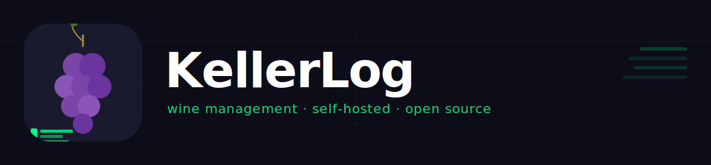
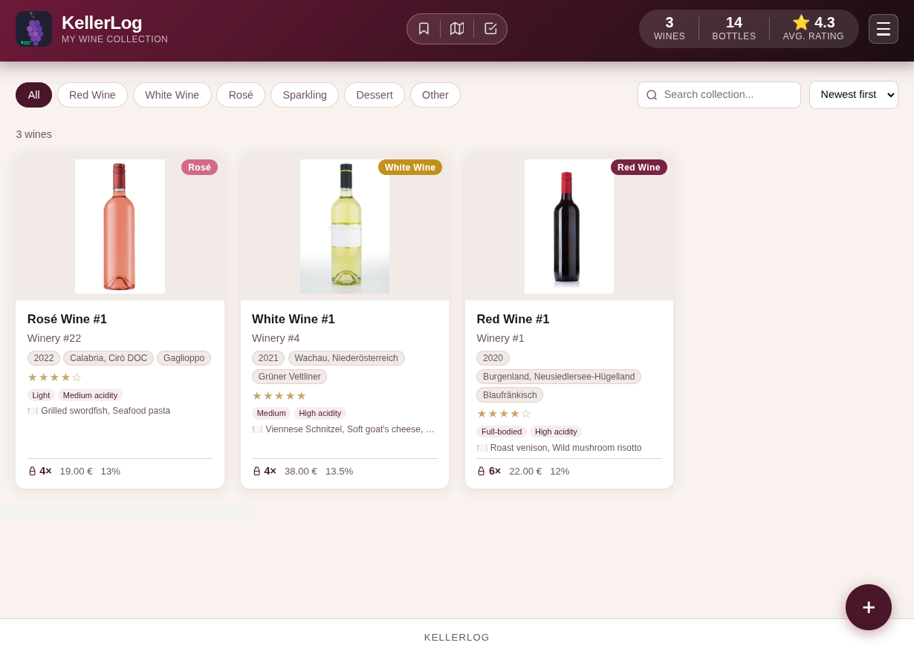
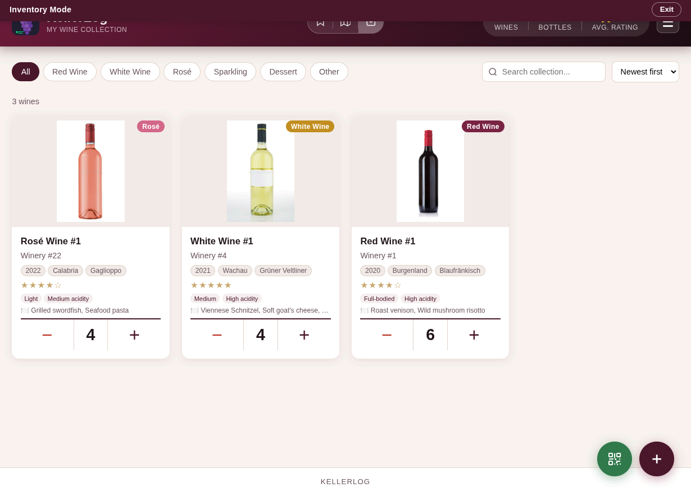
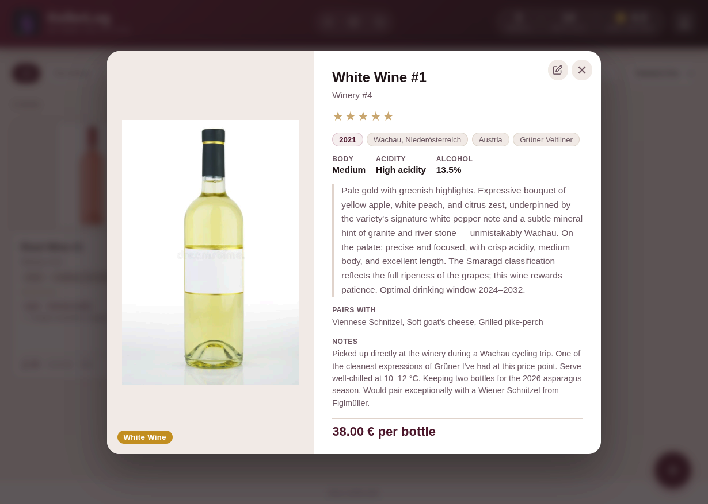

# KellerLog

A self-hosted wine cellar management app. Track your collection, scan barcodes, manage inventory, and share a read-only kiosk view for guests.



## Screenshots

| Collection | Inventory Mode | Wine Details |
|:---:|:---:|:---:|
|  |  |  |

## Features

- **User accounts** — JWT-based login with Admin and Viewer roles; admins can write, viewers are read-only
- **Wine collection** — add, edit, and delete wines with photos, tasting notes, ratings, and food pairings
- **Wine library** — reusable wine database; add to inventory with one click, duplicate entries, propagate edits to matching wines
- **Barcode scanner** — scan a wine bottle to auto-fill details via the WineAPI
- **Inventory mode** — quickly adjust bottle counts with +/− controls; wines with zero bottles are removed when you exit
- **Kiosk view** — a clean, read-only wine list at `/kiosk` for guests or a wall display; configurable per admin (title, subtitle, map button, footer, enable/disable)
- **Glass wine mode** — mark wines as available by the glass, with optional per-glass price; filterable in kiosk view
- **Wine map** — world map showing where your wines come from, with automatic geocoding for unknown regions via Nominatim
- **Import / Export** — backup and restore your collection as JSON or CSV
- **Branding** — customize the title, logo, accent color, and dark mode
- **PWA / installable** — install as a home screen app on mobile and desktop
- **i18n** — German and English UI

## Docker Images

Pre-built images are published to GitHub Container Registry on every release:

| Image | Tags |
|-------|------|
| `ghcr.io/krapfalat/kellerlog-frontend` | `latest` (release), `edge` (main) |
| `ghcr.io/krapfalat/kellerlog-backend` | `latest` (release), `edge` (main) |

Both images are built for `linux/amd64` and `linux/arm64`.

## Tech Stack

| Layer | Technology |
|-------|-----------|
| Frontend | SvelteKit (SPA, static adapter) |
| Backend | FastAPI + SQLAlchemy |
| Database | SQLite |
| Proxy | nginx |
| Deployment | Docker Compose |

## Getting Started

### Prerequisites

- Docker and Docker Compose

### Installation

Create a `docker-compose.yml`:

```yaml
services:
  backend:
    image: ghcr.io/krapfalat/kellerlog-backend:latest
    volumes:
      - ./kellerlog:/app/data
    environment:
      - KELLERLOG_SECRET_KEY=${KELLERLOG_SECRET_KEY}
      - KELLERLOG_ADMIN_USER=${KELLERLOG_ADMIN_USER:-admin}
      - KELLERLOG_ADMIN_PASSWORD=${KELLERLOG_ADMIN_PASSWORD}
      - WINEAPI_KEY=${WINEAPI_KEY:-}
    restart: unless-stopped

  frontend:
    image: ghcr.io/krapfalat/kellerlog-frontend:latest
    ports:
      - "8080:80"
    depends_on:
      - backend
    environment:
      - BACKEND_HOST=backend
    restart: unless-stopped
```

Create a `.env` in the same directory:

```env
# Required: JWT signing secret — generate with:
# python3 -c "import secrets; print(secrets.token_hex(32))"
KELLERLOG_SECRET_KEY=your_secret_key_here

# Admin account (created on first run if no users exist)
KELLERLOG_ADMIN_USER=admin
KELLERLOG_ADMIN_PASSWORD=your_admin_password_here

# Optional: enables barcode lookup and wine search — get a key at https://wineapi.io
WINEAPI_KEY=your_wineapi_key_here
```

> If `KELLERLOG_ADMIN_PASSWORD` is not set, a random password is generated at startup and printed once to the container logs.

Start:

```bash
docker compose up -d
```

Open [http://localhost:8080](http://localhost:8080) and log in with your admin credentials.

### Updating

```bash
docker compose pull
docker compose up -d
```

## Configuration

### Environment variables

| Variable | Required | Description |
|----------|----------|-------------|
| `KELLERLOG_SECRET_KEY` | **Yes** | JWT signing secret. Generate with `python3 -c "import secrets; print(secrets.token_hex(32))"`. Must persist across restarts — all sessions are invalidated if it changes. |
| `KELLERLOG_ADMIN_USER` | No | Username for the initial admin account (default: `admin`). Only used on first run. |
| `KELLERLOG_ADMIN_PASSWORD` | Recommended | Password for the initial admin account. Auto-generated and printed to logs if not set. |
| `WINEAPI_KEY` | No | API key for barcode lookup and wine search ([wineapi.io](https://wineapi.io)) |
| `BACKEND_HOST` | No | Hostname of the backend service as seen by nginx (default: `backend`). Change if you rename the Docker service. |

### User management

Admins can create, edit, and delete user accounts from the hamburger menu → **User Management**. Two roles are available:

- **Admin** — full read/write access
- **Viewer** — read-only (cannot add, edit, or delete wines)

### Kiosk

The kiosk view at `/kiosk` is publicly accessible without login. Admins can configure it from the hamburger menu → **Kiosk Settings**:

- Enable or disable the kiosk entirely
- Set the title and subtitle displayed in the kiosk header
- Toggle the map button and footer visibility

### Branding

App name, subtitle, accent color, logo, and dark mode are configurable through the UI — hamburger menu → **Branding**. Settings are stored per-browser in localStorage.

### Data

Wine data and uploaded images are stored in the `kellerlog/` directory (created automatically on first run). Back it up to keep your collection safe.

## Routes

| Path | Description |
|------|-------------|
| `/` | Main collection view (login required) |
| `/login` | Login page |
| `/kiosk` | Read-only guest view (public) |

## API

The backend exposes a REST API at `/api/`. Write endpoints require a Bearer token (obtained via `POST /api/auth/login`).

### Auth

| Method | Path | Auth | Description |
|--------|------|------|-------------|
| `POST` | `/api/auth/login` | — | Login; returns JWT token |
| `GET` | `/api/auth/me` | Any | Current user info |
| `GET` | `/api/auth/users` | Admin | List all users |
| `POST` | `/api/auth/users` | Admin | Create user |
| `PUT` | `/api/auth/users/{id}` | Admin | Update user |
| `DELETE` | `/api/auth/users/{id}` | Admin | Delete user |

### Wines

| Method | Path | Auth | Description |
|--------|------|------|-------------|
| `GET` | `/api/wines` | — | List all wines |
| `POST` | `/api/wines` | Admin | Add a wine |
| `PUT` | `/api/wines/{id}` | Admin | Update a wine |
| `DELETE` | `/api/wines/{id}` | Admin | Delete a wine |
| `GET` | `/api/lookup/{barcode}` | Any | Barcode lookup |
| `GET` | `/api/search` | Any | Wine search via WineAPI |
| `GET` | `/api/stats` | — | Collection statistics |
| `GET` | `/api/export/json` | Any | Export as JSON |
| `GET` | `/api/export/csv` | Any | Export as CSV |
| `POST` | `/api/import` | Admin | Import JSON or CSV |

### Settings

| Method | Path | Auth | Description |
|--------|------|------|-------------|
| `GET` | `/api/settings` | — | Get kiosk settings |
| `PUT` | `/api/settings` | Admin | Update kiosk settings |

## AI Disclaimer

This project was built with the assistance of [Claude Code](https://claude.ai/code) by Anthropic. AI-generated code has been reviewed and tested, but may contain imperfections. Use at your own risk.

## License

MIT
